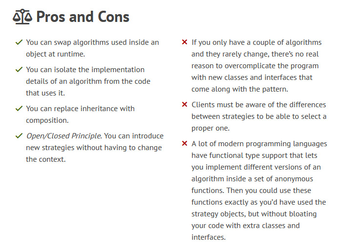
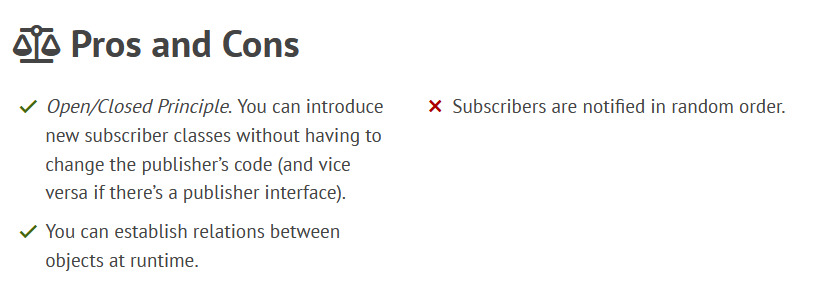
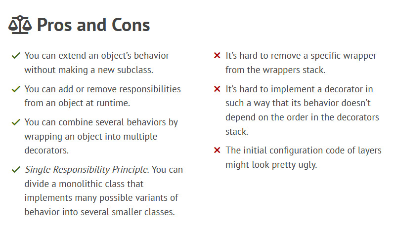
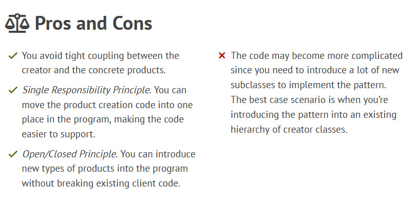
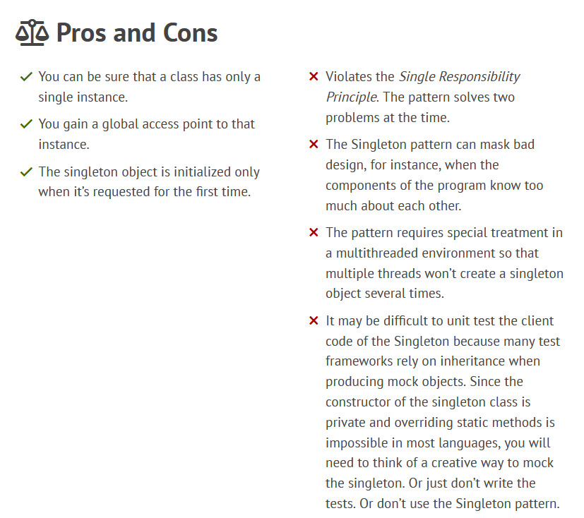

# Design Patterns Notes

## Note: A lot of these notes and codes is based on the [Design Patterns](https://refactoring.guru/design-patterns).

 strategy Pattern 

## Strategy Pattern:

### Defination

- Strategy is a behavioral design pattern that lets you define a family of algorithms, put each of them into a separate class, and make their objects interchangeable.

### Problem

- Any change to one of the algorithms, whether it was a simple bug fix or a slight adjustment of the street score, affected the whole class, increasing the chance of creating an error in already-working code.
  In addition, teamwork became inefficient. Your teammates, who had been hired right after the successful release, complain that they spend too much time resolving merge conflicts. Implementing a new feature requires you to change the same huge class, conflicting with the code produced by other people.

### Solution

- The Strategy pattern suggests that you take a class that does something specific in a lot of different ways and extract all of these algorithms into separate classes called strategies.
  The original class, called context, must have a field for storing a reference to one of the strategies. The context delegates the work to a linked strategy object instead of executing it on its own.
  The context isn’t responsible for selecting an appropriate algorithm for the job. Instead, the client passes the desired strategy to the context. In fact, the context doesn’t know much about strategies. It works with all strategies through the same generic interface, which only exposes a single method for triggering the algorithm encapsulated within the selected strategy.
  This way the context becomes independent of concrete strategies, so you can add new algorithms or modify existing ones without changing the code of the context or other strategies.

### UML Diagram

### Pros and Cons

 Observer Pattern 

## Observer Pattern:

### Defination

- Observer is a behavioral design pattern that lets you define a subscription mechanism to notify multiple objects about any events that happen to the object they’re observing.

### Problem

- It's a Poll problem. Imagine that you have subscripers objects that every now and then ask the publisher class if it has any change and act accordingly.This is a very common problem in the real world.

### Solution

- The Observer pattern suggests that you add a subscription mechanism to the publisher class so individual objects can subscribe to or unsubscribe from a stream of events coming from.Now, whenever an important event happens to the publisher, it goes over its subscribers and calls the specific notification method on their objects.

### UML Diagram

### Pros and Cons

 Decorator Pattern 

## Decorator Pattern:

### Defination

- Decorator is a structural design pattern that lets you attach new behaviors to objects by placing these objects inside special wrapper objects that contain the behaviors.

### Problem

- The problem is that you need to add new behavior to an existing class without modifying the class itself.But Inheritance is not the best option,as at some point it will lead to class explosion due to need for many classes combined.

### Solution

- One of the ways to overcome these caveats is by using Aggregation or Composition.With this new approach you can easily substitute the linked “helper” object with another, changing the behavior of the container at runtime. An object can use the behavior of various classes, having references to multiple objects and delegating them all kinds of work.

### UML Diagram

### Pros and Cons

 Factory Method Pattern 

## Factory Method Pattern:

### Defination

- Factory Method is a creational design pattern that provides an interface for creating objects in a superclass, but allows subclasses to alter the type of objects that will be created.

### Problem

- The problem is that most of your code is coupled to the Specific class. Adding another requirement into the app would require making changes to the entire codebase. Moreover, if later you decide to add another type of feature to the app, you will probably need to make all of these changes again.As a result, you will end up with pretty nasty code, riddled with conditionals that switch the app’s behavior depending on the class of objects.

### Solution

- The Factory Method pattern suggests that you replace direct object construction calls (using the new operator) with calls to a special factory method. Don’t worry: the objects are still created via the new operator,but it’s being called from within the factory method. Objects returned by a factory method are often referred to as products.

### UML Diagram

### Pros and Cons

 Singleton Pattern 

## Singleton Pattern:

### Defination

- Singleton is a creational design pattern that lets you ensure that a class has only one instance, while providing a global access point to this instance.

### Problem

- Ensure that a class has just a single instance. Why would anyone want to control how many instances a class has? The most common reason for this is to control access to some shared resource—for example, a database or a file.
- Provide a global access point to that instance.

### Solution

- Make the default constructor private, to prevent other objects from using the new operator with the Singleton class.
  Create a static creation method that acts as a constructor. Under the hood, this method calls the private constructor to create an object and saves it in a static field. All following calls to this method return the cached object.

### UML Diagram

### Pros and Cons

